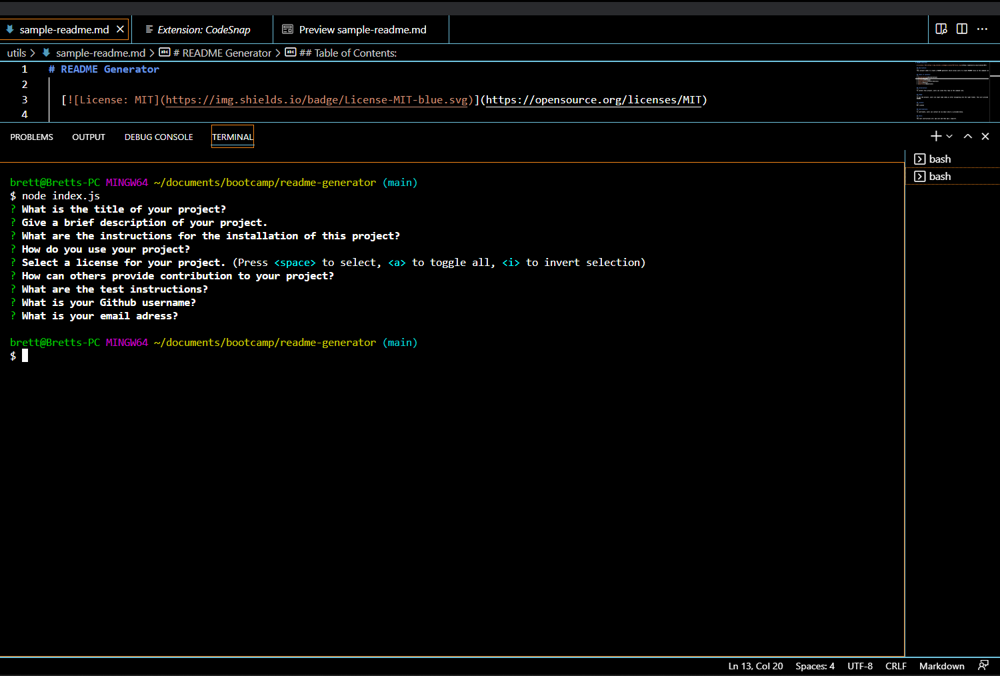

# README Generator

(Homework 9: README Generator)

  

  ## Description:
  ---
  This project seeks to create a README generator which allows users to create README files on the command line.

  ## Table of Contents:
  ---
  * [Installation](#installation)
  * [Screenshots](#Screenshots)
  * [Usage](#usage)
  * [License](#license)
  * [Contributions](#contributions)
  * [Tests](#tests)
  * [Questions](#questions)
  

  ## Installation:
  ---
  To install this project, users can clone this repo on the command line.

  ## Screenshots:
  ---
  [Screenshot1] Terminal showing questions for readme.
  

  
  ## Usage:
  ---
  To use the project, users can input node index.js after navigating into the right folder. This will provide the questions to create the README.

  ## License:
  ---
  MIT License

  ## Contributions:
  ---
  To contribute, users can contact me via email which is provided below.

  ## Tests:
  ---
  The test instructions are: npm init and then npm i inquirer.
  

  ## Questions?
  ---
  If you have any questions regarding the application, feel free to reach out to me directly at brettstephenhockridge@yahoo.com.
  To view some of my other applications, check out my Github page at [BroBrett](https://github.com/BroBrett).
